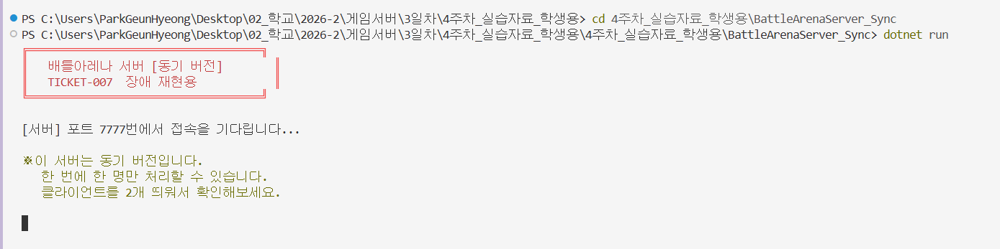
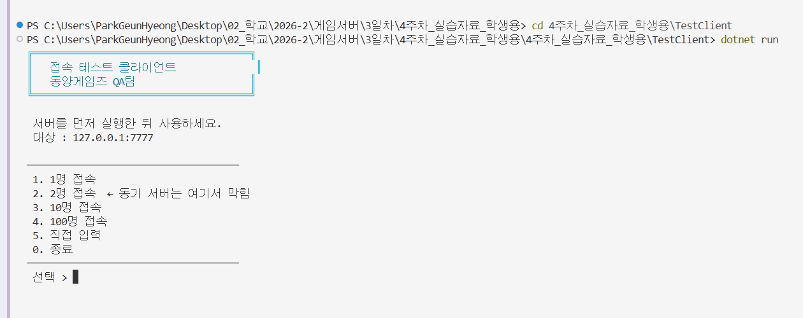
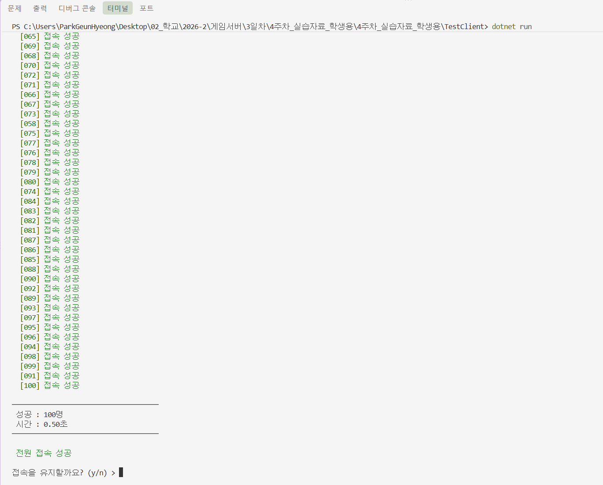
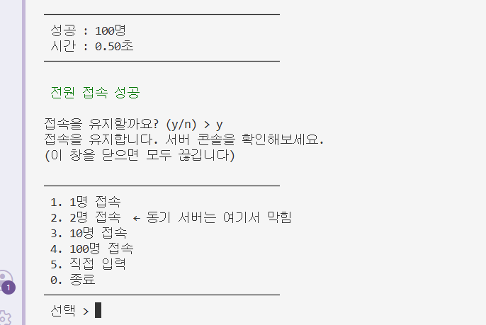
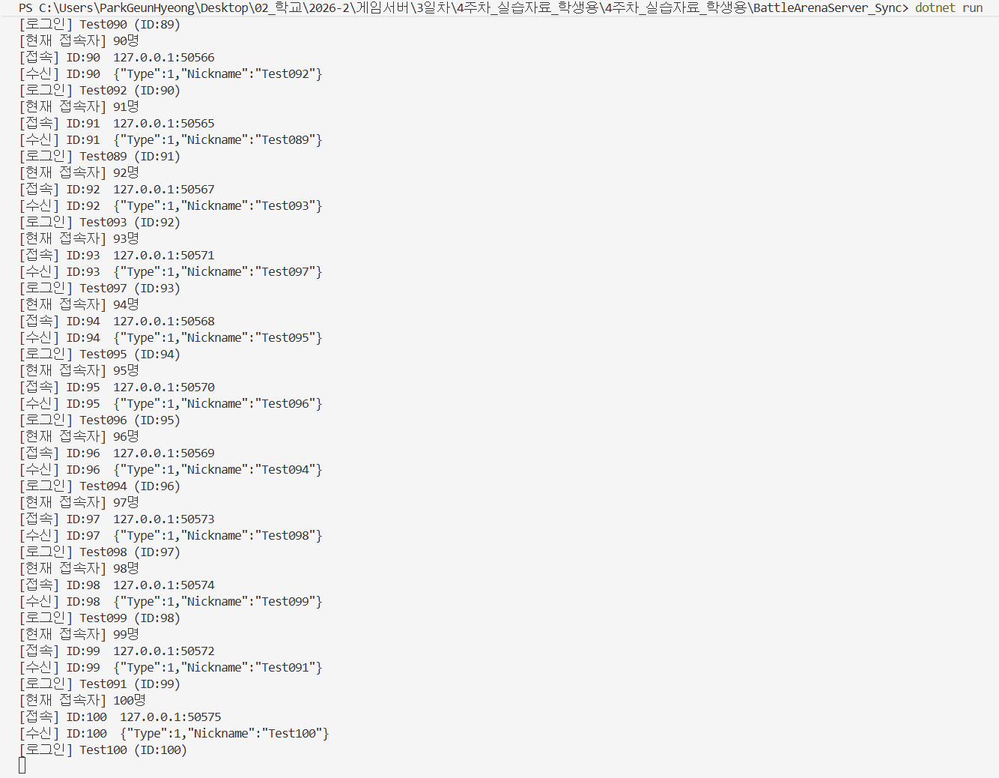

# 배틀아레나 서버 100명 동시 접속 테스트

- 서버: `BattleArenaServer_Sync` (포트 7777)
- 클라이언트: `TestClient` (대상 127.0.0.1:7777)
- 테스트 일시: 2026-10-02

## 1. 동기 서버 실행

서버를 실행하면 포트 7777에서 접속을 기다립니다.

## 2. 테스트 클라이언트 실행

테스트 클라이언트를 실행하고 접속 인원을 선택합니다.

## 3. 100명 동시 접속

`4. 100명 접속`을 선택한 결과, 100명 전원이 0.50초 만에 접속에 성공했습니다.

## 4. 접속 유지

접속을 유지한 상태로 서버 콘솔을 확인합니다.

## 5. 서버 콘솔 확인

서버 콘솔에서 Test001 ~ Test100 전원의 접속과 로그인이 기록되었고, 현재 접속자 수가 100명까지 올라간 것을 확인했습니다.

## 결과 요약

| 항목 | 결과 |
|---|---|
| 접속 시도 | 100명 |
| 접속 성공 | 100명 |
| 소요 시간 | 0.50초 |
